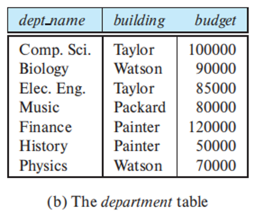

[TOC]

# 第二章：关系模型

## Relational Model

### Mathematical Relations

**域：**每个属性允许的值的集合（可以填什么值）

**属性：**表头（班级姓名学号）

**关系模式：**（表名+属性，e.g. student（Samuel，23009200066））

**元组：**行（2303054，Samuel，23009200066）

**关系：**某一时刻表中所有数据的集合

**关系型数据库：**由多个关系组成，每个关系都存储了一部分信息（学校名单中有学生名单（一个关系），老师名单（一个关系））

### Keys

#### 1. 超码 (Super Key) —— “只要唯一就行”

- **定义**：能唯一标识元组的属性集。
- **特点**：它包含的属性可能“**有点多余**”。只要混在这个集合里，能保证这一行是唯一的，就是超码。
- **例子**：
  - `(学号)`：是超码（因为学号唯一）。
  - `(学号, 姓名)`：也是超码（虽然姓名有重复，但加上学号肯定是唯一的）。
  - `(学号, 姓名, 性别, 班级编号)`：还是超码（带了一堆累赘，但依然唯一）。

#### 2. 候选码 (Candidate Key) —— “唯一且精简”

- **定义**：**最小的**超码。即没有冗余属性的超码。
- **特点**：如果从候选码中去掉任何一个属性，它就无法唯一标识元组了。
- **判定**：
  - `(学号, 姓名)` **不是**候选码。因为去掉“姓名”，“学号”依然唯一，说明“姓名”是多余的。
  - `(学号)` **是**候选码。
  - `(身份证号)` **是**候选码（因为身份证号也是每人唯一的）。
- **总结**：这张表里有两个候选码：`{学号}` 和 `{身份证号}`。它们都有资格“当老大”。

#### 3. 主码 (Primary Key) —— “被选中的老大”

- **定义**：从候选码中人为选定一个，作为表的主要标识符。
- **特点**：一个表只能有一个主码，且主码不能为空（Not Null）。
- **例子**：
  - 虽然 `{学号}` 和 `{身份证号}` 都是候选码，但在学校管理系统中，我们通常觉得身份证号太长、且涉及隐私。
  - 于是我们**决定**使用 `学号` 作为**主码**。
  - 此时，`身份证号` 就被称为**替代码 (Alternate Key)**。

#### 4. 外码 (Foreign Key) —— “连接的桥梁”

- **定义**：如果一个属性在**本表**中不是主码，但在**另一张表**中是主码，它就是本表的**外码**。

- **作用**：用来建立表与表之间的联系。

- **例子**：

  - 看上面的表，`班级编号 (C_ID)` 在学生表里可能重复（很多人在同一个班）。

  - 但是，在另一张 **“班级信息表”** 中，`班级编号` 是主码。

  - 所以，`C_ID` 是学生表的**外码**。

    

### Integrity of Relational Model

#### 1. 实体完整性 (Entity Integrity)一一对应

> 规则：In a base relation, NO attribute of a primary key can be null.
>
> 翻译：在一个基本关系中，主码的任何属性都不能为空（NULL）。

主码（Primary Key）的作用是**唯一标识**一个实体（比如一个学生）。

#### 2. 参照完整性 (Referential Integrity)外码不为空

> 规则：If a foreign key exists in a relation, either the foreign key value must match a candidate key value of some tuple in its home relation or the foreign key value must be wholly null.
>
> 翻译：如果一个关系中存在外码，那么这个外码的值：要么等于被参照关系中某个主码的值，要么完全为空（NULL）。

这是为了防止出现“孤儿数据”。

- 如果学生表中写了“这个学生在 C01 班”，那么班级表中就必须真的存在“C01”这个班。

- 你不能说“这个学生在 火星班”，结果学校里压根没这个班。

  

### Query Language

**Categories of languages：**

Procedural(过程化的)

Non-procedural, or declarative(非过程化的，声明性的)

**Mathematical relational languages:**

Relational algebra(关系代数)

Tuple relational calculus(元组演算)

Domain relational calculus (域演算)

## Relational Algebra

#### 1. 选择 (Select / Selection)

- **符号:** $\sigma$ (Sigma)
- **定义:** $\sigma_{P}(R)$
- **用途:** **水平分割**。根据条件 $P$ 筛选出满足条件的关系 $R$ 中的**元组（行）**。
- **示例:** $\sigma_{age > 18}(Student)$​ （选出年龄大于18岁的学生）

#### 2. 投影 (Project / Projection)

- **符号:** $\pi$ (Pi)
- **定义:** $\pi_{A_1, A_2, ..., A_k}(R)$
- **用途:** **垂直分割**。从关系 $R$ 中选择出指定的**属性（列）**，并自动去除重复行。
- **示例:** $\pi_{name, id}(Student)$ （只显示学生的姓名和ID，并且去掉学生姓名与ID相同的行）

#### 3. 并 (Union)

- **符号:** $\cup$
- **定义:** $R \cup S$
- **用途:** 返回包含在 $R$ 中**或**在 $S$ 中的所有元组，并自动去除重复行。
- **前提:** $R$ 和 $S$ 必须是**相容的（Compatible）**，即属性数量相同且对应属性的域相同。

#### 4. 集合差 (Set Difference)

- **符号:** $-$
- **定义:** $R - S$
- **用途:** 返回在 $R$ 中但**不在** $S$ 中的元组。
- **前提:** $R$ 和 $S$ 必须是**相容的**。

#### 5. 笛卡尔积 (Cartesian Product)

- **符号:** $\times$
- **定义:** $R \times S$
- **用途:** 将 $R$ 中的每一个元组与 $S$ 中的每一个元组进行拼接。如果 $R$ 有 $m$ 行，$S$ 有 $n$ 行，结果将有 $m \times n$ 行。

#### 6. 更名 (Rename)

- **符号:** $\rho$ (Rho)
- **定义:** $\rho_{X}(E)$
- **用途:** 将关系表达式 **$E$** 的结果重命名为 $X$。这对自连接（Self-Join）或简化复杂表达式非常重要。

例子：Find the the instructors’ ID and names, with a salary greater than $90,000.

$\pi_{name, id}(\sigma_{salary > ‘90000’}(instructor))$ 

注：除特别要求外，写查询表达式时不需要写出结果集

### Additional Operations

#### 1. 集合交 (Set Intersection)

- **符号:** $\cap$
- **定义:** $R \cap S$
- **用途:** 返回同时属于 $R$ **和** $S$ 的元组。
- **前提:** $R$ 和 $S$ 必须是**相容的**。

#### 2. 自然连接 (Natural Join)

- **符号:** $\bowtie$

- **定义:** $R \bowtie S$

- **用途:** 在两个关系的**公共属性**上进行等值连接，并**去除重复的属性列**。这是数据库中最常用的操作。

- 推导 (Derivation):

  假设 $R$ 和 $S$ 的公共属性列表为 $A$，则：

  $$R \bowtie S = \pi_{UniqueCols}(\sigma_{R.A=S.A}(R \times S))$$

  (解释：先做笛卡尔积，然后筛选公共属性相等的行，最后投影去掉重复列。)
  
  备注：一般在$\bowtie$下写笛卡尔积条件

#### 3. 除法 (Division)

- **符号:** $\div$

- **定义:** $R \div S$

- **用途:** 用于回答包含“**所有 (for all)**”的查询。

  - 例如：$R$ 是 (学生, 课程)，$S$ 是 (课程)。$R \div S$ 选出那些“选修了 $S$ 中**所有**课程”的学生。
  - 假设 $R$ 的属性集为 $(A, B)$，$S$ 的属性集为 $(B)$，结果包含属性 $A$。

- 推导 (Derivation):

  这是最复杂的推导：

  $$R \div S = \pi_{A}(R) - \pi_{A}((\pi_{A}(R) \times S) - R)$$

  (解释逻辑：先找出所有候选人 $\pi_A(R)$，然后找出“不合格”的人（即至少有一门 $S$​ 中的课没修的人），最后从候选人中减去不合格的人。)
  
  不要求除数保持连续

### Extended Operations

#### 1. Left Outer Join (左外连接)

- **符号:** r ⟕ s  (形状像左边封口的蝴蝶结 ⟕)
- **含义:** 保留左边 $r$ 的所有元组。

#### 2. Right Outer Join (右外连接)

- **符号:** r ⟖ s (形状像右边封口的蝴蝶结 ⟖)
- **含义:** 保留右边 $s$ 的所有元组。

#### 3. Full Outer Join (全外连接)

- **符号:** r ⟗ s (形状像两边都封口的蝴蝶结 ⟗)
- **含义:** 保留两边的所有元组。

## Relational Calculus

关系演算是基于数学逻辑的一个分支，后者称为谓词演算。关系演算是一种非过程化的查询语言，每个查询的形式为：{t | P(t)}。

它是所有满足谓词P的元组t的集合，其中t是一个元组变量，t[A]表示元组t在属性A上的值，称为t在属性A上的分量，R(t)表示元组t在关系R中，或t ϵ R。P是谓词演算的一个公式。

$$
R_1 = \{ t \mid S(t) \land t[A] > '2' \}
$$

- **含义:** 从 $S$ 中选出元组 $t$，满足属性 $A$ 的值大于 2。
- 对应关系代数: **选择** (Selection):$\sigma_{A > 2}(S)$​

$$
R_2 = \{ t \mid R(t) \land \neg S(t) \}
$$

- **含义:** 选出元组 $t$，它属于 $R$ 且不属于 $S$。
- 对应关系代数: **集合差** (Set Difference):$R - S$

$$
R_3 = \{ t \mid S(t) \land \exists u (R(u) \land t[C] < u[B]) \}
$$

- **含义:** 从 $S$ 中选出元组 $t$且必须存在一个 $R$ 中的元组 $u$，使得 $t$ 的 $C$ 列值小于 $u$ 的 $B$ 列值。

$$
R_4 = \{ t \mid R(t) \land \forall u (S(u) \rightarrow t[C] > u[A]) \}
$$

- **含义：**
  - 在 $R$ 中查找元组 $t$。
  - 对于 $S$ 中的每一个元组 $u$，如果它属于 $S$，那么 $t$ 的 $C$ 值必须大于 $u$ 的 $A$ 值。
  - 简单来说: 选出那些 $C$ 值比 $S$ 表中所有 $A$ 值都大的 $R$​​​ 元组。

**构造一个新的元组**：
$$
R_5 = \{ t \mid \exists u \exists v (R(u) \land S(v) \land u[A] > v[B] \land t[B] = u[B] \land t[C] = v[C] \land t[A] = u[A]) \}
$$

- **含义：**
  - 这实际上是一个 Theta Join (连接) 加上 Projection (投影/重组)。
  - 它不只是筛选 $R$ 或 $S$ 的原始行，而是造出一个新的元组 $t$。
  - 连接条件: $R.A > S.B$ ($u[A] > v[B]$)。
  - 结果构造: 新元组的列分别取自：$u$ 的 $B$， $v$ 的 $C$， $u$ 的 $A$​。

### Safety of Experience

**关系代数 (RA)** 是**天生安全**的。因为它基于有限的表进行有限的操作（投影、选择、连接等），只要输入是有限的，输出必然是有限的。

**元组关系演算 (TRC)** 是**基于逻辑**的。逻辑可以定义“无限”的集合（比如“不等于1的所有整数”），因此我们需要人为地加上“安全性限制 (Safety Restriction)”来确保它能被计算机处理。

## Example Queries

**查询结果与已知关系结构相同时，t 可直接定义到该关系上**

**方法一：麻烦的写法（显式构造）**

如果你非要重新定义 $t$ 的每一列：
$$
\{ t \mid \exists v ( department(v) \land v[budget] > 10000 \land \underbrace{t[name]=v[name] \land t[build]=v[build] \land t[budget]=v[budget]}_{\text{好麻烦！要把所有列抄一遍}} ) \}
$$
**方法二：直接定义（你的问题所指的情况）**

因为结果就是个完整的“系”，结构没变，我们可以直接把 $t$ 定义在 department 关系上：
$$
\{ t \mid department(t) \land t[budget] > 10000 \}
$$

- **解释：** 这里 $department(t)$ 这句话就隐含了“$t$ 拥有 `department` 表的所有列，且 $t$ 存在于该表中”。我们不需要再写 $t[name]=...$​ 了。

**Q1: Find budget of the department where the instructor ‘Einstein’ is in.(表a称为u，表b称为v)**

$\{ t \mid \exists u ( \textbf{instructor}(u) \land \exists v ( \textbf{department}(v) \land u[\textit{dept\_name}] = v[\textit{dept\_name}] \land u[\textit{name}] = \text{'Einstein'} ) \land t[\textit{budget}] = v[\textit{budget}] ) \}$

*问题：为什么结果是$t$这个集合，题目要求是找到这个预算，是否和题目要求不符?*

*答：这**符合**题目要求。因为在关系数据库理论中，**所有的查询结果必须是一个关系（Relation），也就是一张表**。数据库永远不会只扔给你一个裸露的数字（Scalar），它给你的永远是包含这个数字的一行一列的小表。*

这是图片内容的Markdown整理版本，包含了逻辑公式、查询目标以及等价转换的过程。

**Q2: Find instructors’ ID who does NOT teaches course CS-315.**

**这是一个一阶逻辑中的等价转换规则，用于解释如何将全称量词转换为存在量词的否定：**
$$
\forall x ( P(x) \rightarrow Q(x) ) \iff \neg \exists x ( P(x) \wedge \neg Q(x) )
$$
**第一步：使用全称量词 ($\forall$)**

这是最直观的逻辑表达：对于该讲师教的所有课程，课程ID都不等于 CS-315。

$\{ t \mid \exists u ( \text{instructor}(u) \wedge \forall v ( \text{teaches}(v) \wedge v[\text{ID}] = u[\text{ID}] \rightarrow v[\text{course\_id}] \neq \text{'CS-315'} ) \wedge t[\text{ID}] = u[\text{ID}] ) \}$

**第二步：转换形式 ($\neg \exists$)**

应用右上角的逻辑规则，将“所有...都不...”转换为“不存在...是...”。

即：不存在一门课，既是该讲师教的，且课程ID等于 CS-315。

$\{ t \mid \exists u ( \text{instructor}(u) \wedge \neg \exists v ( \text{teaches}(v) \wedge v[\text{ID}] = u[\text{ID}] \wedge v[\text{course\_id}] = \text{'CS-315'} ) \wedge t[\text{ID}] = u[\text{ID}] ) \}$
